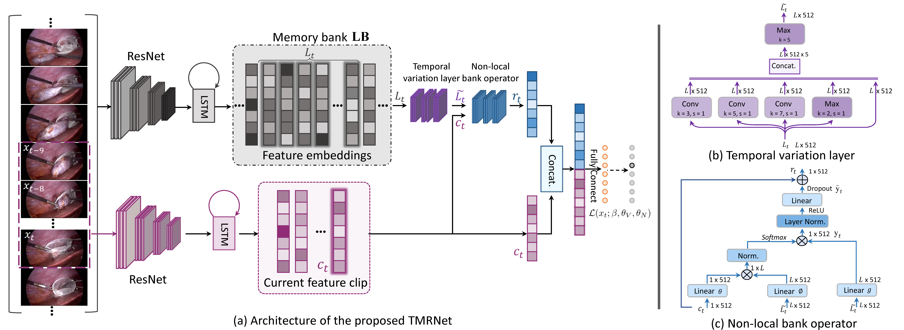

# Temporal Memory Relation Network for Workflow Recognition from Surgical Video
by [Yueming Jin](https://yuemingjin.github.io/), [Yonghao Long](https://scholar.google.com/citations?user=HIjQdFQAAAAJ&hl=zh-CN), [Cheng Chen](https://scholar.google.com.hk/citations?user=bRe3FlcAAAAJ&hl=en), [Zixu Zhao](https://scholar.google.com.hk/citations?user=GSQY0CEAAAAJ&hl=zh-CN), [Qi Dou](http://www.cse.cuhk.edu.hk/~qdou/), [Pheng-Ann Heng](http://www.cse.cuhk.edu.hk/~pheng/). 

## Introduction
* The Pytorch implementation for our paper '[Temporal Memory Relation Network for Workflow Recognition from Surgical Video](https://arxiv.org/abs/2103.16327)', accepted at IEEE Transactions on Medical Imaging (TMI).

<p align="center">
  
</p>

## Data Preparation
* We use the dataset [Cholec80](http://camma.u-strasbg.fr/datasets) and [M2CAI 2016 Challenge](http://camma.u-strasbg.fr/m2cai2016/index.php/program-challenge/).

* Training and test data split

   Cholec80: first 40 videos for training and the rest 40 videos for testing, following the original paper [EndoNet](https://arxiv.org/abs/1602.03012).

   M2CAI: 27 videos for training and 14 videos for testing, following the [challenge evaluation protocol](http://camma.u-strasbg.fr/m2cai2016/index.php/program-challenge/).

* Data Preprocessing: 
1. Using [FFmpeg](https://www.ffmpeg.org/download.html) to convert the videos to frames; 
2. Downsample 25fps to 1fps (Or can directly set the convert frequency number as 1 fps in the previous step); 
3. Cut the black margin existed in the frame;
4. Resize original frame to the resolution of 250 * 250.

* The structure of data folder is arranged as follows:
```
(root folder)
├── data
|  ├── cholec80
|  |  ├── cutMargin
|  |  |  ├── 1
|  |  |  ├── 2
|  |  |  ├── 3
|  |  |  ├── ......
|  |  |  ├── 80
|  |  ├── phase_annotations
|  |  |  ├── video01-phase.txt
|  |  |  ├── ......
|  |  |  ├── video80-phase.txt
├── code
|  ├── ......
```


## Setup & Training

1. Check dependencies:
   ```
   - pytorch 1.0+
   - opencv-python
   - numpy
   - sklearn
   ```
2. Clone this repo
    ```shell
    git clone https://github.com/YuemingJin/TMRNet
    ```

2. Training model for building memory bank

* Switch folder ``$ cd ./code/Training memory bank model/``

* Run ``$ get_paths_labels.py`` to generate the files needed for the training

* Run ``$ train_singlenet_phase_1fc.py`` to start the training

3. Training TMRNet

* Switch folder ``$ cd ./code/Training TMRNet/``

* Put the well-trained model obtained from step 2 to folder ``./LFB/FBmodel/``

* Run ``$ get_paths_labels.py`` to generate the files needed for the training

* Set the args 'model_path' in ``train_*.py`` to ``./LFB/FBmodel/{your_model_name}.pth``

* Run ``$ train_*.py`` to start the training
  ```
  Note: In the first time to run train_*.py files, set the args 'load_LFB' to False to generate the memory bank
  We have three configurations about train_*.py:
  1.train_only_non-local_pretrained.py: only capture long-range temporal pattern (ResNet);
  2.train_non-local_mutiConv_resnet.py: capture long-range multi-scale temporal pattern (ResNet);
  3.train_non-local_mutiConv_resnest.py: capture long-range multi-scale temporal pattern (ResNeSt), achieving the best results.
  ```
## Testing


## Citation
If this repository is useful for your research, please cite:
```
@ARTICLE{9389566,
    author={Y. {Jin} and Y. {Long} and C. {Chen} and Z. {Zhao} and Q. {Dou} and P. -A. {Heng}},
    journal={IEEE Transactions on Medical Imaging}, 
    title={Temporal Memory Relation Network for Workflow Recognition from Surgical Video}, 
    year={2021},
    volume={},
    number={},
    pages={1-1},
    doi={10.1109/TMI.2021.3069471}
}
```

### Questions

For further question about the code or paper, please contact 'ymjin5341@gmail.com'
